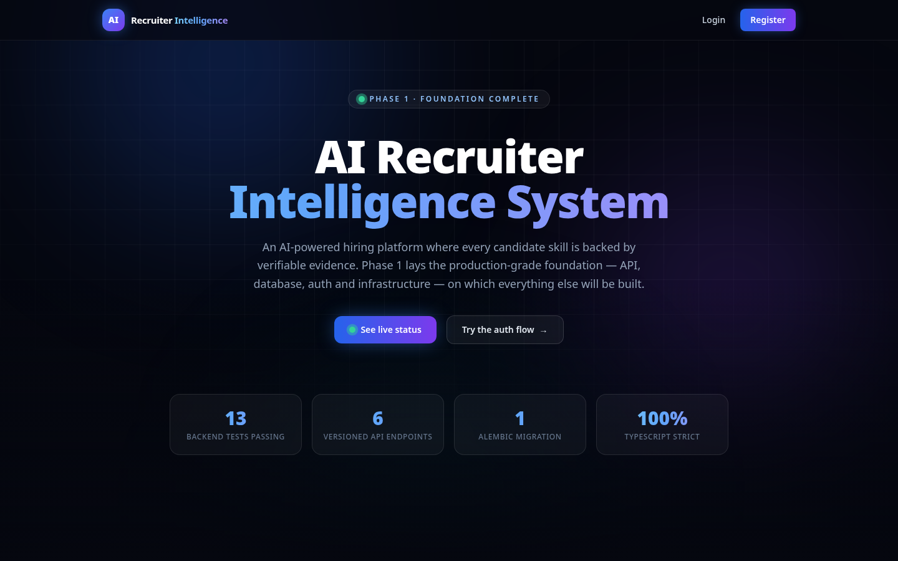
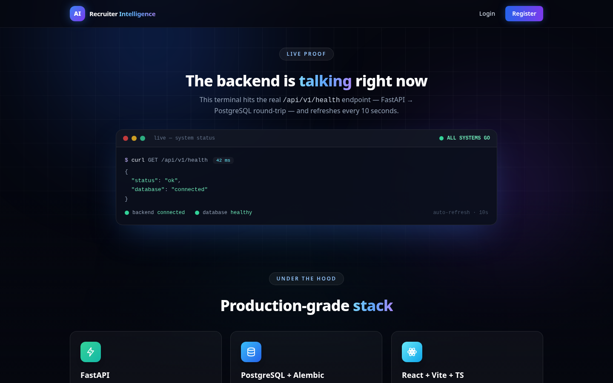
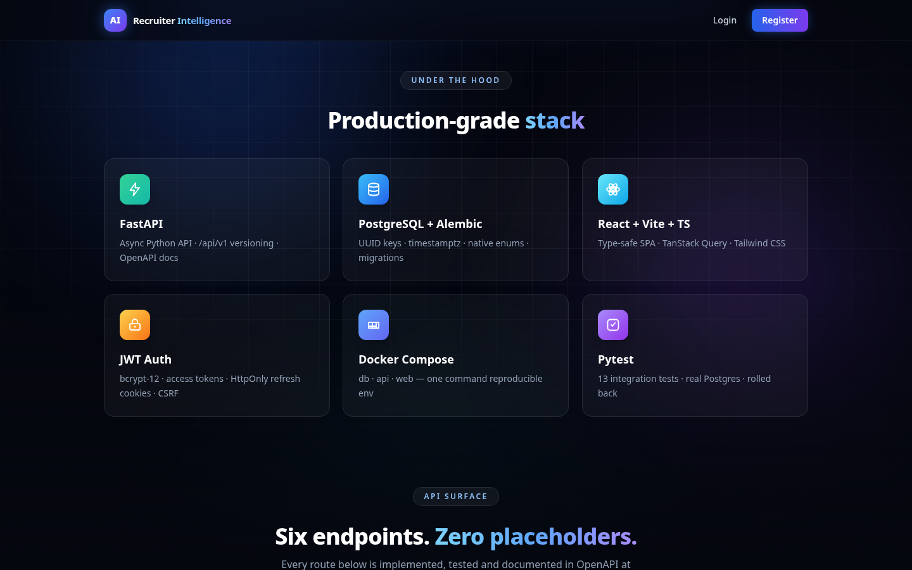
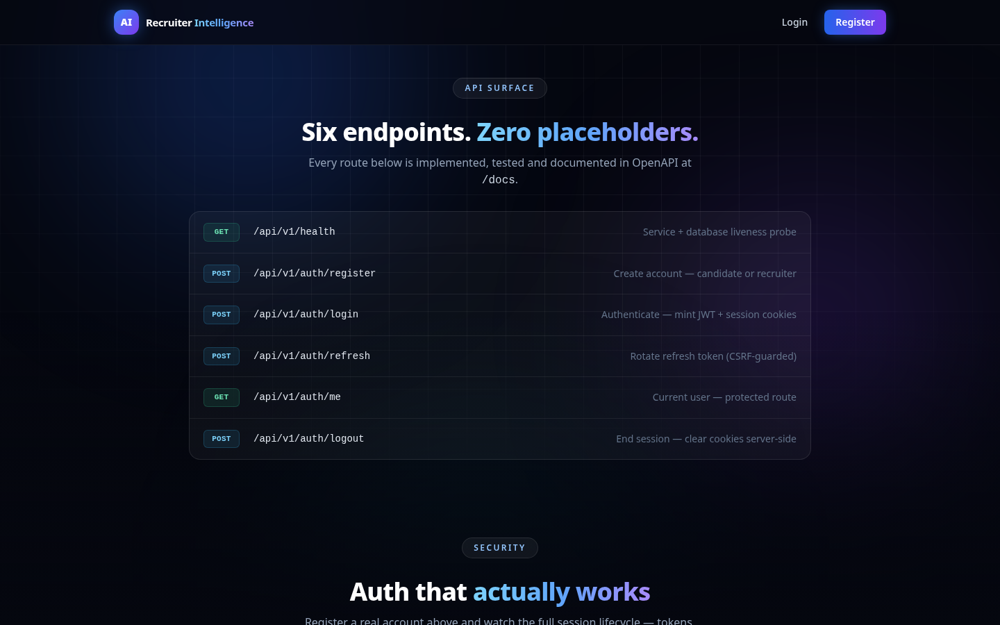
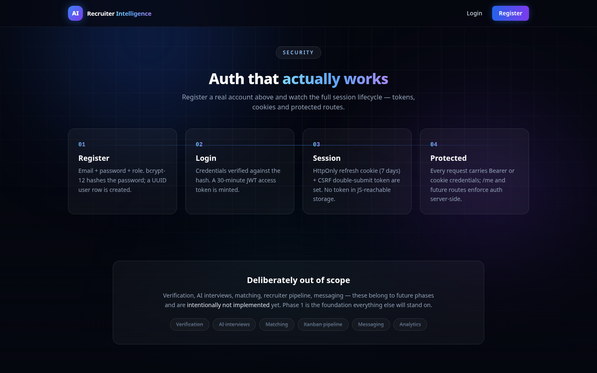
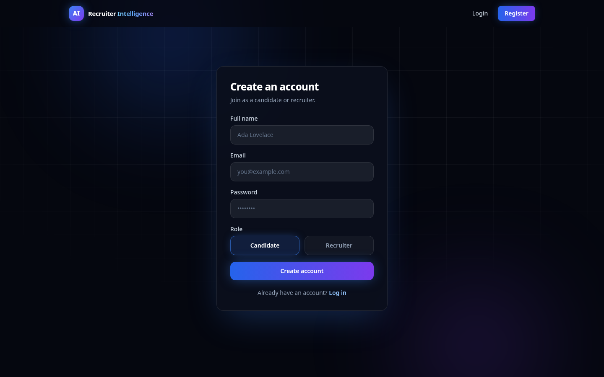
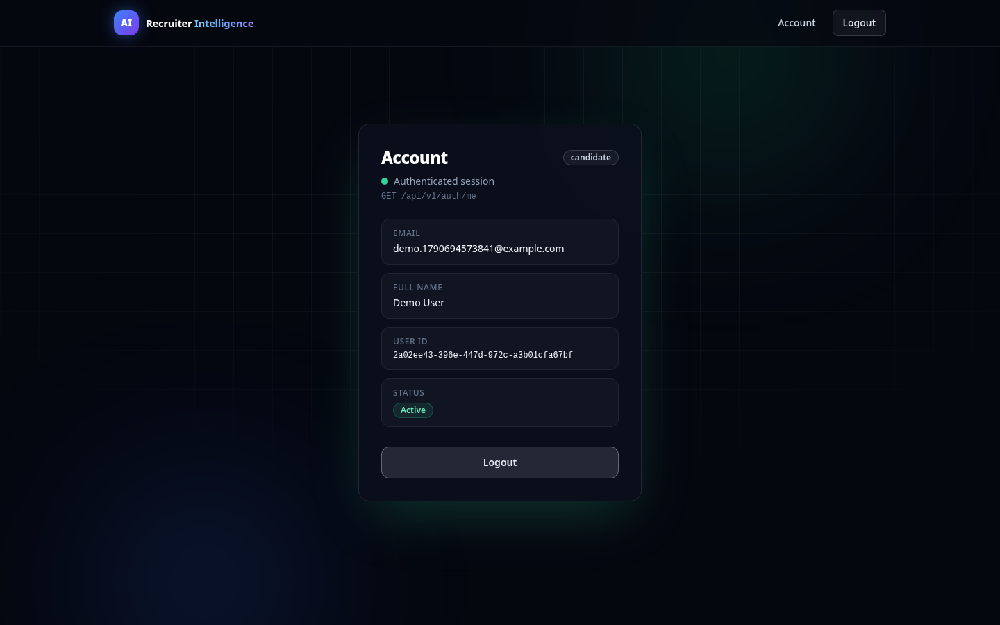

# Phase 1 — Live Demonstration

Everything in Phase 1 is real: a FastAPI backend on PostgreSQL, JWT auth with
HttpOnly refresh cookies, and a React + TypeScript frontend — all verified by
13 integration tests and the screenshots and videos below, captured from a
live run (no mocks, no staged UI).

## Demo videos (20 seconds each)

### 1. Landing page tour — `videos/demo-landing-tour.mp4`

<video src="videos/demo-landing-tour.mp4" controls width="100%"></video>

Animated walkthrough of the Phase 1 showcase page: hero, the **live**
FastAPI → PostgreSQL status terminal (auto-refreshes every 10s), technology
stack, the six implemented API endpoints, and the four-step auth architecture.
[Direct link](videos/demo-landing-tour.mp4)

### 2. Real registration → protected account — `videos/demo-auth-flow.mp4`

<video src="videos/demo-auth-flow.mp4" controls width="100%"></video>

A real account is typed in and created against the live API; the protected
`/account` page then loads the user from `GET /api/v1/auth/me` with the fresh
JWT session. [Direct link](videos/demo-auth-flow.mp4)

## Screenshots

| # | Screenshot | What it proves |
|---|-----------|----------------|
| 1 |  | Animated Phase 1 landing page, live phase stats |
| 2 |  | Real `GET /api/v1/health` → `{"status":"ok","database":"connected"}`, 62 ms, auto-refresh |
| 3 |  | FastAPI · PostgreSQL + Alembic · React + Vite + TS · JWT Auth · Docker Compose · Pytest |
| 4 |  | All six Phase 1 routes, versioned under `/api/v1` |
| 5 |  | Register → Login → Session → Protected route, plus deliberate out-of-scope list |
| 6 |  | Real registration form with role selector and validation |
| 7 |  | Protected account page for a freshly registered user (UUID, role, Active status) |

## What was created (Phase 1 scope)

**Backend** (`apps/backend/`)

- FastAPI app with `/api/v1` versioned routers, OpenAPI docs, request-id
  middleware, and a structured error envelope (`{error:{code,message,details}}`)
- PostgreSQL schema via Alembic migration `0001_initial_auth`: `user_role`
  enum, `users` table (UUID PK, email unique, bcrypt-12 password hash,
  role, timestamps), `refresh_tokens` table (hashed tokens, expiry, revoke)
- Auth: register, login, refresh (HttpOnly cookie + CSRF double-submit),
  logout, `GET /auth/me`, `POST /auth/logout-all`
- 13 integration tests (`pytest`) against a real PostgreSQL database —
  registration, duplicate-email rejection, login success/failure, token
  refresh rotation, protected-route guards, error-envelope shape

**Frontend** (`apps/frontend/`)

- React + Vite + TypeScript (strict) + Tailwind SPA with TanStack Query
- Dark animated Phase 1 showcase landing page: aurora/grid background,
  glassmorphism, scroll-reveal animations, **live backend health terminal**
  (polls `GET /api/v1/health` every 10s, shows measured latency)
- Auth pages: register (role selector), login, protected account, 404 —
  matching design, loading states, validation errors
- `tsc --noEmit` clean, ESLint clean, production build green

**Infrastructure**

- Docker Compose: `db` (PostgreSQL), `api` (FastAPI), `web` (Nginx + built SPA)
- Healthchecks and service dependency ordering in `infra/docker-compose.yml`

## How to reproduce

```bash
# 1. start the stack
docker compose -f infra/docker-compose.yml up --build

# 2. run the backend tests (needs a local PostgreSQL)
cd apps/backend
TEST_DATABASE_URL=postgresql+psycopg://postgres@127.0.0.1:5432/phase1_test \
  .venv/bin/pytest -q        # expect: 13 passed

# 3. regenerate screenshots + videos (needs frontend on :5173, API on :8123)
cd docs/demo/scripts
node screenshots.mjs
./record.sh landing
./record.sh auth
```

Recording uses headless Chrome via `puppeteer-core` under Xvfb — see
`scripts/` for the drivers. The auth video registers a genuinely new user
each run (timestamped email), so nothing is staged.

## Honest caveats

- Docker Compose files are reviewed and YAML-validated, but container-to-container
  runtime was not verified in this environment (no Docker daemon available);
  the live demo above ran the same services as native processes.
- Videos are 1280×800 @ 30 fps, ~20 s each, captured from real runs on
  2026-09-29.
